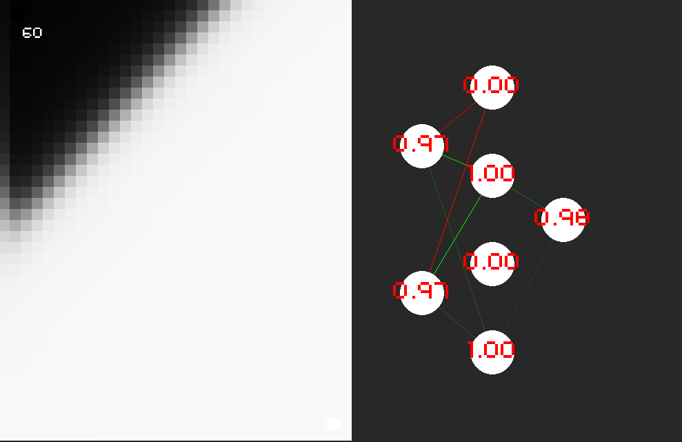

# Neural Network implementation (with visualization of the training)
### There you can see how a neural network trains itself, controls: (Space : start trainig , LEFTMOUSEBUTTON: put a white dot, RIGHTMOUSEBUTTON : put a balack dot)
    CREATE AN INSTANCE:
    self.nn = Neural_Network((WIDTH//2, 0), (2, 4, 4, 1))
    First parameter where to draw the NN (topleft), second maps layers
    
    TRAINING:
    (an example for fraining to solve XOR)
    training_data = [[[0,0],[0]],
                                 [[1,0],[1]],
                                 [[0,1],[1]],
                                 [[1,1],[0]],
                                 ]
    choice = random.choice(training_data)
    self.nn.train(choice[0], choice[1])
    
    PREDICTION:
    self.nn.predict([c[0]/(WIDTH/2/CELL_SIZE), c[1]/(HEIGHT/CELL_SIZE)])[0]
    

